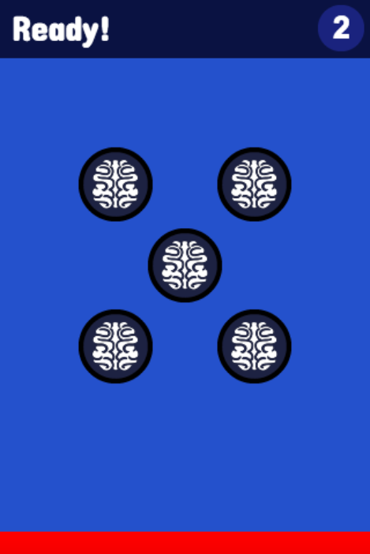
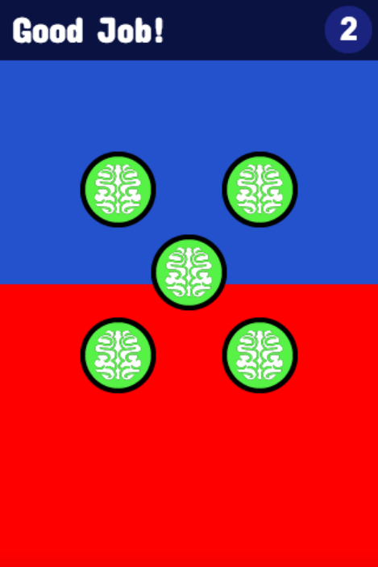

Brain Balls [(Demo)][1]
==========

>Brain Balls is a memory game created with Phaser.js. The aim of the game is to remember sequences of balls.

### Run
* ```$ grunt```
* visit http://localhost:3000


Ready Screen               |  Win Screen
:-------------------------:|:-------------------------:
        |  

[1]: http://mertkahyaoglu.github.io/brainballs/
